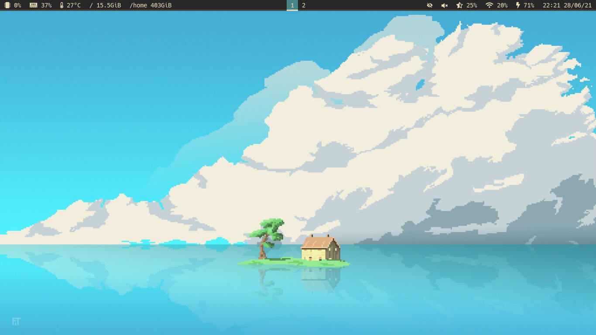
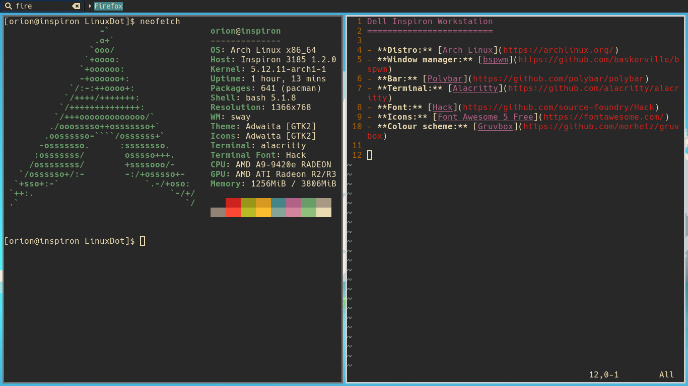

Dell Arch Sway
=========================

- **Distro:** [Arch Linux](https://archlinux.org/)
- **Window manager:** [Sway](https://swaywm.org)
- **Bar:** [Polybar](https://github.com/polybar/polybar)
- **Terminal:** [Alacritty](https://github.com/alacritty/alacritty)
- **Font:** [Hack](https://github.com/source-foundry/Hack)
- **Icons:** [Font Awesome 5 Free](https://fontawesome.com/)
- **Colour scheme:** [Gruvbox](https://github.com/morhetz/gruvbox)

