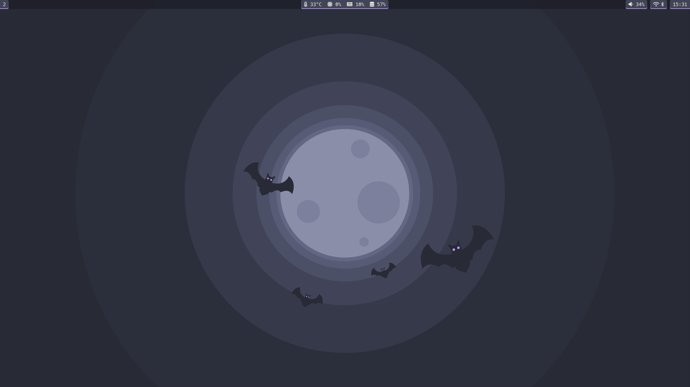
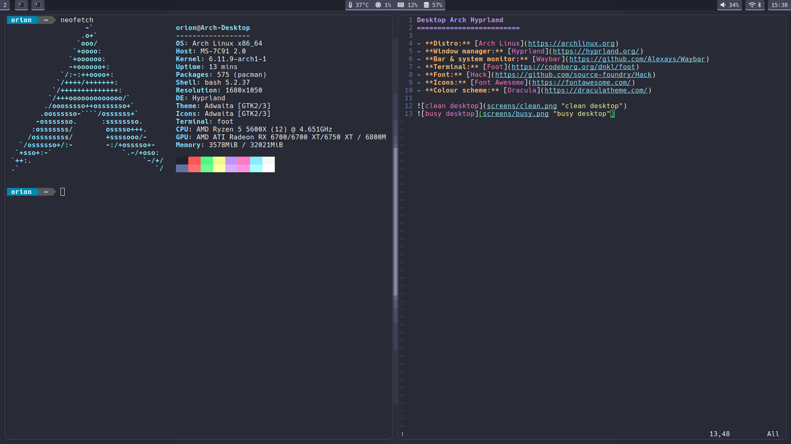

Desktop Arch Hyprland
=========================

- **Distro:** [Arch Linux](https://archlinux.org)
- **Window manager:** [Hyprland](https://hyprland.org/)
- **Bar:** [Waybar](https://github.com/Alexays/Waybar)
- **Terminal:** [Foot](https://codeberg.org/dnkl/foot)
- **Font:** [Hack](https://github.com/source-foundry/Hack)
- **Icons:** [Font Awesome](https://fontawesome.com/)
- **Colour scheme:** [Dracula](https://draculatheme.com/)

