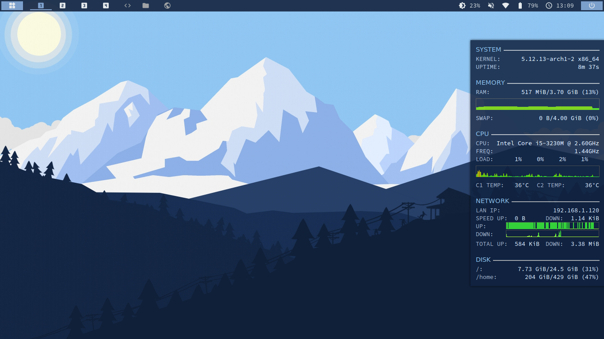
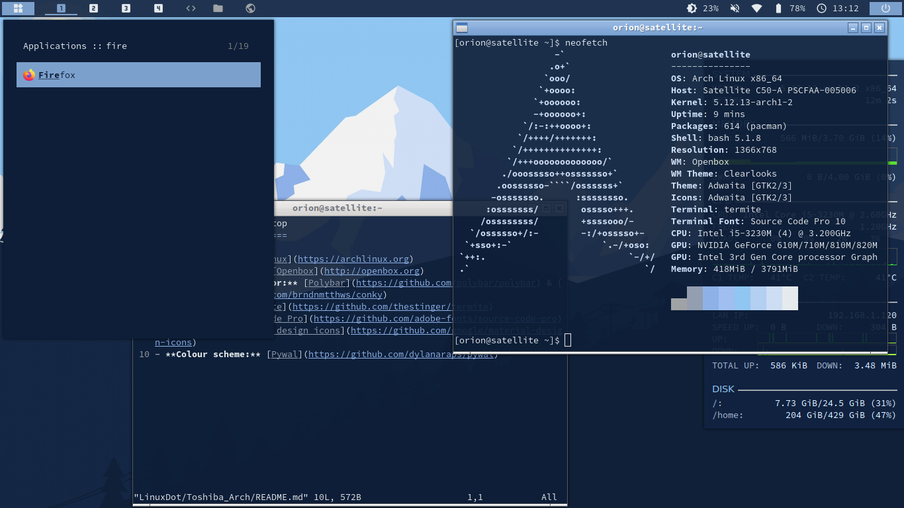

Toshiba Arch Openbox
=========================

- **Distro:** [Arch Linux](https://archlinux.org)
- **Window manager:** [Openbox](http://openbox.org)
- **Bar & system monitor:** [Polybar](https://github.com/polybar/polybar) & [Conky](https://github.com/brndnmtthws/conky)
- **Terminal:** [Termite](https://github.com/thestinger/termite)
- **Font:** [Source Code Pro](https://github.com/adobe-fonts/source-code-pro)
- **Icons:** [Material design icons](https://github.com/google/material-design-icons)
- **Colour scheme:** [Pywal](https://github.com/dylanaraps/pywal)

