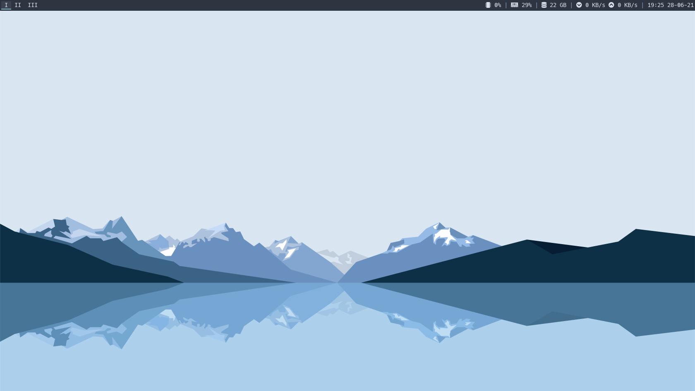
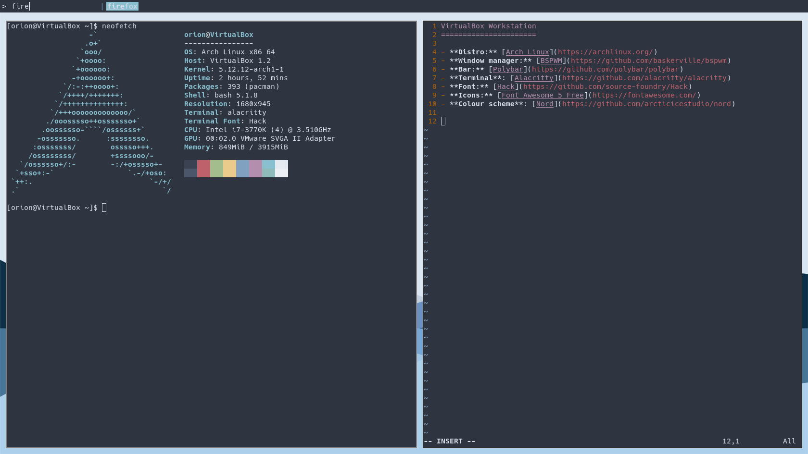

VirtualBox Arch bspwm
======================

- **Distro:** [Arch Linux](https://archlinux.org/)
- **Window manager:** [bspwm](https://github.com/baskerville/bspwm)
- **Bar:** [Polybar](https://github.com/polybar/polybar)
- **Terminal:** [Alacritty](https://github.com/alacritty/alacritty)
- **Font:** [Hack](https://github.com/source-foundry/Hack)
- **Icons:** [Font Awesome 5 Free](https://fontawesome.com/)
- **Colour scheme:** [Nord](https://github.com/arcticicestudio/nord)

